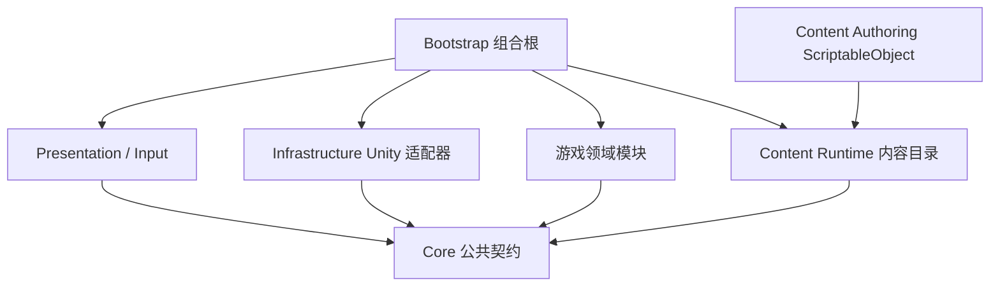

# WAR-PEACE 游戏代码框架设计

> 版本：0.2
> 状态：代码架构基线
> 依据：`大纲.md` v0.26、`docs/设计问答.md` Q01-Q21 批次 A-B、Q16.1-Q16.7
> 说明：本文只定义模块、接口、状态归属、数据流和实施顺序，不包含具体 C# 实现、ScriptableObject 资产或 asmdef 文件。

## 一、目标与边界

### 1.1 目标

本框架需要同时满足两类目标：

1. 为完整的领主战争游戏预留稳定边界，包括战略地图、实时行军、遭遇、经营、势力外交、即时战斗、自动结算、存档和战役胜负。
2. 让第一阶段可以只实现独立即时战斗原型，不因为尚未设计的战略、经营和外交细节而返工。

架构遵循以下原则：

- 规则与 Unity 表现分离。部队、资源和战斗规则以纯 C# 数据模拟运行，GameObject 只负责显示、输入、动画和特效。
- 单一状态所有权。每个模块只通过命令修改自己的状态，其他模块不能直接写内部字段。
- 契约优先。跨模块调用依赖 Core 中的接口、命令、快照和事件，不依赖具体实现类型。
- 数据驱动。单位、装备、敌人、地图、场景、经济和公式均由 Data 层提供，并经过启动校验。
- 确定性。战略推进和战斗模拟使用固定步长及分域随机种子，相同输入应产生相同结果。
- 渐进实现。完整框架先定义边界，实际代码按开发阶段逐个落地，不提前制造空壳系统。

### 1.2 当前明确不做

- 不实现多人、联网同步、Mod 和玩家自制地图。
- 第一阶段不实现战役、战略地图、经营、外交、遭遇切换或自动结算。
- 不引入 DOTS、第三方依赖注入框架或额外架构包。
- 不通过事件总线代替明确业务流程。事件用于广播已发生事实，关键流程仍由流程服务显式编排。
- 不允许 UI、AI 或表现对象直接修改领域状态。

### 1.3 第一阶段实现范围

第一阶段只实现以下可运行闭环：

`进入独立战场 -> 生成地形 -> 生成双方部队 -> 编队选择与指挥 -> 敌人 AI 对抗 -> 近战和远程战斗 -> 胜负与伤亡结算`

该闭环仍须使用正式接口：

- 使用同一套 `Battle` 模拟。
- 使用同一套内容目录和公式求值器。
- 使用同一套战斗命令与 AI 命令入口。
- 支持完整战斗状态存档。

战略和经营模块在此阶段只存在于架构边界中，不创建业务实现。

## 二、总体架构

### 2.1 架构风格

采用模块化单体。所有模块位于同一个 Unity 工程和同一个运行进程内，但编译依赖、状态所有权和运行时通信受明确约束。

上层可以调用下层契约，但领域模块不得反向引用 Bootstrap、Presentation 或具体 Infrastructure 实现。

### 2.2 分层职责

| 层 | 职责 | 允许依赖 | 禁止内容 |
| --- | --- | --- | --- |
| Core | ID、命令、查询、事件、快照、时钟、随机数和模块端口 | 标准库及 Unity 兼容的基础数学类型 | 场景对象、MonoBehaviour、具体存档格式 |
| Content | 策划定义、内容目录、引用校验、运行时只读数据 | Core、Unity 编辑器程序集 | 直接执行游戏规则 |
| Modules | 战略、战斗、势力、经济和跨模块流程 | Core、Content 的只读接口 | UI、Scene、Prefab、具体文件读写 |
| Presentation | UI、输入、镜头、动画、音效和表现镜像 | Core、只读快照、命令入口 | 直接修改模块内部状态 |
| Infrastructure | 场景加载、资源加载、文件存储、时间驱动和日志 | Core、Unity API | 领域规则 |
| Bootstrap | 创建具体实现、装配依赖、启动场景和游戏相位 | 所有层的具体实现 | 业务规则本身 |

### 2.3 逻辑目录与程序集边界

进入实现阶段后，建议按以下逻辑目录建立程序集。本次文档工作不会创建这些目录或文件。

| 逻辑区域 | 建议位置 | 程序集职责 |
| --- | --- | --- |
| 公共核心 | `Assets/Scripts/Core` | 无业务模块依赖的公共契约 |
| 内容定义 | `Assets/Scripts/Content/Authoring` | ScriptableObject、内容校验和仅编辑器地图工具 |
| 运行时内容 | `Assets/Scripts/Content/Runtime` | 加载并编译不可变 `ContentCatalog` |
| 领域模块 | `Assets/Scripts/Modules/<Module>` | 每个模块独立状态和服务实现 |
| 表现适配 | `Assets/Scripts/Presentation` | UI、输入、镜头、视图同步 |
| Unity 适配 | `Assets/Scripts/Infrastructure` | 文件、场景、资源和日志实现 |
| 启动组合 | `Assets/Scripts/Bootstrap` | 唯一允许引用全部具体实现的组合根 |
| 测试 | `Assets/Tests` | EditMode、PlayMode 和测试替身 |

依赖规则：

- `Core` 不能引用任何业务模块、Unity 场景或具体数据资产。
- 每个领域模块只能引用 `Core`、必要的只读内容契约和自身内部类型。
- 模块之间不能互相引用运行时实现。跨模块协作通过 Core 接口、命令和快照完成。
- `Bootstrap` 可以引用全部具体实现，但不得承载具体战斗或经济算法。
- `Presentation` 可以引用 Core 和视图模型，不得引用模块内部状态类型。
- `Infrastructure` 不判断命令合法性，只负责技术能力。

后续可根据编译规模把模块拆成独立 asmdef，但依赖方向必须保持不变。第一阶段至少应隔离 `Core`、`Battle`、`Presentation`、`Infrastructure`、`Bootstrap` 和测试程序集。

## 三、运行时拓扑与生命周期

### 3.1 场景结构

| 场景 | 生命周期 | 主要内容 |
| --- | --- | --- |
| `Boot` | 全程常驻 | 组合根、全局服务、内容目录、存档协调器、场景流程、会话状态机 |
| `Strategic` | 战略阶段加载 | 地图视图、城镇视图、部队视图、战略 UI 和输入适配 |
| `Battle` | 战斗阶段加载 | 战场视图、单位镜像、战斗 UI、镜头和战斗输入适配 |

场景切换规则：

- 场景对象不是权威数据。卸载战略场景不会丢失战略状态。
- 进入战斗时卸载战略表现场景，并冻结相关战略部队和战略时钟。
- 返回战略层时根据权威战役快照重建地图、城镇和部队表现。
- 战斗场景只持有当前战斗的临时状态；战斗结束并提交结果后即可销毁。
- 场景加载失败时保持原相位，不提交任何跨模块变更。

### 3.2 游戏相位

游戏相位固定为：

`Bootstrapping -> Strategic -> Encounter -> BattlePreparation -> BattleRunning / BattlePaused -> BattleResolving -> Strategic / Ended`

每个相位必须声明：

- 哪个时钟可以推进。
- 可以接受哪些命令。
- 是否允许存档。
- 当前活动场景。
- 失败时回退到哪个稳定相位。

| 相位 | 推进时钟 | 典型命令 | 可保存状态 |
| --- | --- | --- | --- |
| Bootstrapping | 无 | 载入内容、新游戏、读档 | 否 |
| Strategic | 战略时钟 | 行军、经营、招募、外交、变速 | 是 |
| Encounter | 按暂停范围策略暂停或受限推进 | 战斗、撤退及后续确认的其他决策 | 是，保存待决遭遇 |
| BattlePreparation | 无 | 确认参战部队、进入战场 | 是，保存战斗初始化状态 |
| BattleRunning | 战斗时钟 | 战斗编队命令、暂停 | 是，保存完整战斗状态 |
| BattlePaused | 无 | 允许的指挥命令、恢复战斗 | 是，保存完整战斗状态 |
| BattleResolving | 无 | 应用战果 | 是，保存待提交战果 |
| Strategic | 战略时钟 | 继续战略推进 | 是 |
| Ended | 无 | 重开或返回主菜单 | 可保存最终结果 |

`BattlePaused` 中允许执行的具体操作尚未在设计中最终确定，因此由 Data 中的暂停命令策略控制，不由输入层写死。框架默认允许查看战场和下达可排队的编队命令，实际生效时间由战斗命令队列决定。

### 3.3 时钟模型

全局只暴露一个游戏时钟门面，但内部区分两个逻辑时钟：

- `StrategicClock`：仅在 `Strategic` 相位或允许的战略 UI 子相位推进。
- `BattleClock`：仅在 `BattleRunning` 推进。

规则：

- 暂停只停止对应时钟的模拟推进，不关闭 UI 或命令入口。
- 进入战斗后，战略时钟和外界的其他战略进程停止。
- 返回战略层后，从保存的时钟状态继续，不补算战斗期间的战略时间。
- 战略速度档位、战斗固定步长和暂停策略均来自 Data。

## 四、领域模块

### 4.1 Campaign

职责：

- 持有 `GameSession` 的相位、当前活动场景、战役随机种子和胜负状态。
- 协调“向战斗交接”“应用战果”“结束战役”等跨模块事务。
- 管理 `BattleResult` 的幂等应用，保证同一结果只结算一次。
- 控制自动存档节拍和手动存档的安全提交点。

拥有状态：

- 会话 ID、游戏相位、活动场景标识、战役模式。
- 当前势力、当前日期/时间、会话随机种子。
- 胜利、失败和结束原因。
- 已处理的战果结果 ID 集合。

不负责：

- 不存储地图格子、部队明细、城镇建筑或战斗单位状态。
- 不直接实现经济、外交、寻路或战斗公式。
- 不在某模块事务失败时保留半提交结果。

### 4.2 StrategicMap

职责：

- 保存和查询格子地图的地形、高度、动态占格、据点、地图对象和地图边界。
- 维护地图对象的占格结果、旋转、连接、通行结果及附属资源点。
- 为后续战争迷雾、已探索信息和可见情报保留接口；首版暂不实现迷雾。
- 根据 `ITraversalRule` 判断通行与实时移动速度修正。
- 提供路径查询和战斗地形生成上下文。

拥有状态：

- 格子坐标、地形档案 ID、高度、静态通行事实和当前部队占格 ID。
- 城镇、村落、据点、多格地图对象、对象旋转、连接节点和已解析占格。
- 附属资源点及其所属地图对象关系。
- 地图静态元数据、生成种子和地图定义 ID。
- 首版不创建探索层、可见层和已知情报快照。

边界：

- 已确认战略地图为实时制，部队使用移动速度而不是回合制行动点，并且只能进入上下左右方向的相邻格，不能斜向移动。
- 山地格子不可通行，相邻格之间落差大于 1 时不可通行。
- 首版不制作道路，因此不设计道路移动加成和道路通行限制。
- 不同可通行地形的移动速度修正由 Data 独立配置。
- 合法落差内的上坡、下坡和落差速度修正由 Data 配置。
- 一个格子最多只能容纳一支部队。
- 尝试进入敌方占据格会触发实时战斗。
- 首版不制作固定渡口、关口、传送连接等特殊路线。
- 地图边缘不可通行，不制作环形地图或跨地图出口。
- 地图边界只需阻止继续移动，不存在剩余移动力结转。
- 城镇、村落和据点允许生成，并可能占用多个格子。
- 多格对象的占地、旋转、连接和通行由地图生成程序决定；生成程序必须把结果解析为可查询、可存档的 `MapObjectState`。
- 资源点附属在地图对象上，不作为首版独立占格对象。
- 地图内部工具负责地形修改和地图对象生成。
- 地图 Data 应尽量覆盖地图相关参数和调试需求。
- 首版地形除移动速度外不额外影响遭遇和视野。
- 首版暂不制作战争迷雾。
- Q16 剩余的特殊能力绕行和速度修正细节尚未确定。
- 框架不写死“可直接穿行”等规则。
- 规则必须通过 `ITraversalRule` 和 Data 提供，地图模块只执行规则并返回结果。

### 4.3 StrategicSimulation

职责：

- 按固定战略 tick 推进地图时间。
- 执行部队移动、到达、停止和路线重算。
- 按正交相邻关系推进移动，并依据地形、落差、占格和地图对象通行结果校验每一步。
- 使用战略视角下的圆形粗略碰撞检测空间接触，并检查势力关系是否触发遭遇。
- 调度战略 AI 决策。

拥有状态：

- 正在执行的战略移动。
- 当前格、下一格、移动速度修正和等待遭遇决策的暂停状态。
- 已完成但尚未由战果提交处理的事件状态。
- 战略 AI 决策节拍和冷却。

协调：

- 移动命令由 `Forces` 和 `StrategicMap` 的只读数据共同校验。
- 同一格不能容纳第二支部队；进入友方占据格按占格规则拒绝，进入敌方占据格生成遭遇。
- 遭遇只产生 `EncounterDetected`，由 `Encounter` 创建待决遭遇。
- 战略 AI 与玩家使用同一套命令服务，不允许直接修改位置或部队。

### 4.4 SettlementsEconomy

职责：

- 管理城镇、村落、领地归属、资源、人口、幸福度和建筑。
- 计算资源产出、维护消耗、建筑升级和兵员供给。
- 将城镇幸福度和补给能力提供给部队与战斗公式。

拥有状态：

- 资源库存、人口、岗位和幸福度。
- 建筑实例、等级、状态、损毁和岗位分配。
- 城镇所属势力、防御水平和领地关系。

边界：

- 建筑网格尺寸、人口转化和资源公式尚未最终确定。
- 这些规则全部由 Data 和结构化公式提供。
- 第一阶段不创建运行时城镇，也不接入生产循环。

### 4.5 Forces

职责：

- 管理势力、部队、编队、兵员、装备、经验和损耗。
- 提供战前部队快照和战后兵力变更。
- 在战斗期间冻结参战部队，防止同一部队被重复调度。
- 支持招募、补充、编制调整和战斗占用标记。

拥有状态：

- 部队 ID、所属势力、所属编队、当前位置和任务状态。
- 部队兵员、装备、士气、经验和战斗状态。
- 参战预留信息、战斗结果待应用状态。

协调：

- `Encounter` 只读取部队快照并发出参战预留命令。
- `Battle` 获得的是战斗初始状态的副本，不直接修改 `Forces`。
- `Campaign` 在战斗结束后用 `BattleResult` 更新 `Forces`。

### 4.6 Encounter

职责：

- 将空间接触转化为明确的战前遭遇。
- 处理战斗、撤退及后续确认的其他决策。
- 使用战略视角下的圆形粗略碰撞进行检测，不逐格详细渲染；检测半径与触发时点由 Data 提供。
- 检测到遭遇后等待玩家决策，并按暂停范围策略停止相关移动或战略推进。
- 创建不含 Unity 对象引用的战斗启动请求。
- 决定战斗种子、战场档案和战略上下文。

拥有状态：

- 待决遭遇、参与方、遭遇位置、时间、检测档案、暂停范围和选择结果。
- 战斗启动请求及其生命周期状态。

当前边界：

- 立即决策至少包含战斗和撤退。
- “避战”和“撤退”是否为同一选项、自动结算是否作为独立决策，以及遭遇期间是否暂停全部战略移动，仍由后续设计决定。
- 在规则确定前，暂停范围和可选决策都由策略配置提供，不写死在 UI 或 Encounter 核心中。

输出：

- `BattleLaunchRequest`：参与方、地图位置、地形档案、目标类型、战斗模式、随机种子。
- `EncounterDecisionSet`：当前遭遇允许显示的决策选项。
- `EncounterResolved`：本次遭遇选择已经确定。

### 4.7 Battle

职责：

- 创建和推进独立战场状态。
- 生成战场地形、出生区域、胜负目标和双方编队。
- 执行移动、攻击、停驻、撤退、阵型、接敌、伤亡和士气规则。
- 运行战斗 AI，并向单位施加与玩家相同的合法命令。
- 输出不可变 `BattleResult`。

拥有状态：

- 战场静态地形和动态战斗状态。
- 编队、单位、生命、位置、目标、命令、士气和冷却。
- 战斗时间、目标进度、胜负结果和完整战斗快照。

边界：

- 战斗模块不读取战略场景对象。
- 不直接修改势力库存、领地或战略部队。
- 第一阶段的 `BattleScenario` 是战斗初始化来源，不属于战略流程。

### 4.8 FactionsDiplomacy

职责：

- 维护势力身份、战争、和平、联盟、态度和外交约束。
- 向战略 AI、遭遇和战斗权限提供关系查询。

当前状态：

- 先冻结稳定的查询与命令边界。
- 科技、政策、联盟义务和背叛机制等待后续设计，暂不实现具体规则。

### 4.9 Persistence

职责：

- 从所有 `ISaveParticipant` 捕获版本化快照。
- 通过基础设施写入和读取存档。
- 处理版本迁移、内容签名校验、备份和损坏保护。
- 在战斗进行中保存完整战斗快照。

拥有状态：

- 当前存档节拍、自动档索引、活动槽位和最近一次成功保存信息。

不负责：

- 不复制模块内部可变对象。
- 不把 Prefab、Transform、GameObject 或 Instance ID 写入存档。
- 不由单个模块直接操作文件系统。

## 五、公共契约

### 5.1 契约族

| 契约族 | 作用 | 调用方 | 实现方 |
| --- | --- | --- | --- |
| `I*CommandService` | 校验并提交模块命令 | UI、AI、流程服务 | 对应领域模块 |
| `I*Query` | 返回只读快照或按规则裁剪的情报 | UI、AI、其他模块 | 对应领域模块 |
| `IDomainEventBus` | 发布已经发生的事实 | 领域模块 | Core 或基础设施事件总线 |
| `IGameClock` | 读取和控制战略/战斗时钟 | 流程、表现、模块 | 时间基础设施 |
| `IContentCatalog` | 按稳定 ID 查询不可变定义 | 所有规则模块 | Content Runtime |
| `ISceneFlow` | 请求加载、卸载和重建场景 | Campaign | 场景基础设施 |
| `ISaveParticipant` | 捕获和恢复模块状态 | Persistence | 各领域模块 |
| `IStrategicAiPolicy` | 产生战略 AI 命令 | 战略调度器 | 战略 AI 实现 |
| `ICombatAiPolicy` | 产生战斗 AI 命令 | 战斗调度器 | 战斗 AI 实现 |
| `IBattleSimulationFactory` | 从请求创建独立战斗 | Encounter、第一阶段 Boot | Battle 模块 |
| `IBattleResolver` | 无界面执行自动结算 | Encounter | Battle 规则核心 |
| `ITraversalRule` | 判断格子和地形通行语义 | StrategicMap、寻路 | 可配置规则实现 |
| `IEncounterDetector` | 使用圆形碰撞检测空间接触 | StrategicSimulation | Encounter 检测实现 |
| `IEncounterPausePolicy` | 决定遭遇期间暂停哪些时钟或移动 | Encounter、GameClock | 可配置策略 |
| `IMapGenerationService` | 根据地图数据和种子生成地图对象布局 | Map Authoring、StrategicMap | 地图生成实现 |

命令返回值至少区分：

- `Accepted`：命令已进入执行队列。
- `Applied`：命令已在当前 tick 提交。
- `Deferred`：命令合法，但只在指定相位生效。
- `Rejected`：前置条件不满足，状态不变，并返回稳定错误码。

命令错误码用于 UI 和日志，不使用异常处理预期中的业务拒绝。

### 5.2 命令语义

战略与流程命令：

| 命令 | 主要负责人 | 关键前置条件 |
| --- | --- | --- |
| `IssueArmyMove` | StrategicSimulation | 部队可用、起点合法、路径只经过正交相邻格、地形与落差可通行、占格规则满足 |
| `SetTimeMode` | Campaign / GameClock | 当前相位允许变速 |
| `RecruitArmy` | Forces / SettlementsEconomy | 城镇归属、资源、人口和编制上限满足 |
| `QueueConstruction` | SettlementsEconomy | 领地所有权、地块、资源和建筑规则满足 |
| `ResolveEncounterDecision` | Encounter | 遭遇仍在等待决策 |
| `EnterBattle` | Campaign / Encounter | 战斗请求合法且相关部队已预留 |

战斗命令：

| 命令 | 主要负责人 | 关键前置条件 |
| --- | --- | --- |
| `IssueFormationMove` | Battle | 编队存活、目标位置合法、命令来源有权限 |
| `IssueFormationAttack` | Battle | 目标可见、目标可攻击、命令在有效战术域内 |
| `IssueFormationHold` | Battle | 编队存活 |
| `IssueFormationRetreat` | Battle | 当前战斗规则允许该编队撤退 |
| `SetFormationStance` | Battle | 阵型或姿态已在 Data 中定义 |

选择、框选、悬停、镜头和 UI 面板展开只属于表现状态，不生成领域命令。

### 5.3 查询语义

- 查询只返回不可变快照、值对象或只读视图。
- 战争迷雾启用后，战略查询必须按观察势力过滤情报；首版不启用该过滤。
- 战斗查询可以返回完整战斗快照，但玩家 UI 和 AI 仍应通过各自允许的情报规则消费。
- 模块内部缓存可以用于性能优化，但不能成为保存或结算依据。
- 查询不产生副作用，不推进 AI，不触发自动存档。

关键查询包括：

- `CampaignSnapshot`
- `VisibleStrategicMapSnapshot`
- `ArmySnapshot`
- `SettlementSnapshot`
- `EncounterPrompt`
- `BattleSnapshot`
- `BattleResultPreview`（仅规则允许预测时）
- `ContentCatalog`

### 5.4 事件语义

事件是过去式事实，不是命令。

核心事件包括：

- `ArmyMoved`
- `EncounterDetected`
- `EncounterResolved`
- `BattleRequested`
- `BattleStarted`
- `BattleResolved`
- `SettlementChanged`
- `CampaignEnded`

事件规则：

- 状态先提交，再发布对应事件。
- 同一 tick 内事件顺序必须固定。
- 事件订阅者不能同步修改事件源模块状态。
- 如果事件处理需要改变状态，只能向下一 tick 提交新命令。
- 表现层可以订阅事件，但应把更新排队到表现帧，避免战斗 tick 受渲染逻辑影响。

## 六、状态管理

### 6.1 权威状态

运行时存在三个权威状态域：

| 状态域 | 所有者 | 生命周期 | 是否进入存档 |
| --- | --- | --- | --- |
| `CampaignState` | 各战略模块、由 Campaign 根快照汇总 | 当前整局 | 是 |
| `BattleState` | Battle | 单场战斗 | 是，战斗中断或待提交时 |
| `PresentationState` | 各表现控制器 | 当前场景 | 否 |

`PresentationState` 包括选择、镜头、悬停、动画播放和 UI 展开状态，可以丢失并从权威快照重建。

### 6.2 状态访问规则

- 每个状态只能有一个模块可以提交修改。
- 模块公开只读快照，不公开可变集合。
- ID 是跨模块引用的唯一方式，不跨模块传递对象引用。
- 静态内容与运行时状态分离。`UnitDefinition` 不是 `UnitState`，`MapDefinition` 不是 `MapState`。
- 运行时临时句柄不得进入存档。需要持久引用的实体必须拥有稳定运行时 ID 或内容 ID。

### 6.3 跨模块事务

“应用战果”“招募完成”“占领城镇”等操作可能同时影响多个模块，统一由 Campaign 事务协调器执行：

1. 读取前置快照并验证所有前置条件。
2. 生成事务 ID，检查是否已经处理。
3. 让各参与模块准备状态变更。
4. 所有模块准备成功后统一提交。
5. 任一模块失败则回滚全部参与模块。
6. 提交成功后发布领域事件。
7. 若事务要求存档，在一致性边界触发自动存档。

`BattleResult` 必须包含稳定的 `ResolutionId`。Campaign 保存已处理 ID，重复提交同一结果时直接返回成功但不再次修改状态。

### 6.4 tick 管线

每个战略或战斗 tick 按固定顺序执行：

1. 收集玩家输入意图和 AI 意图。
2. 将意图转换为命令并执行合法性校验。
3. 按稳定顺序应用已接受命令。
4. 推进移动、战斗、生产等模拟系统。
5. 检查遭遇、胜负和其他阈值。
6. 提交状态并生成事件。
7. 将事件和快照变化排队给表现层。

不能在 tick 中途直接调用表现对象，也不能让表现帧率影响模拟结果。

## 七、数据管理

### 7.1 数据层次

| 数据层 | 定义方式 | 是否可修改 | 主要用途 |
| --- | --- | --- | --- |
| 策划定义 | ScriptableObject | 编辑阶段修改 | 单位、敌人、地图、战场、经济和公式 |
| 运行时内容目录 | 不可变运行时对象 | 启动后只读 | 模块按 ID 查询定义 |
| 运行时状态 | 模块内部对象 | 通过命令修改 | 当前战役和战斗 |
| 快照 | 不可变值数据 | 只读 | 查询、AI、存档和测试 |
| 存档信封 | 版本化 JSON 数据 | 载入时迁移 | 持久化整局状态 |

### 7.2 内容定义分类

第一阶段至少需要以下定义：

- `UnitDefinition`
- `WeaponDefinition` / `EquipmentDefinition`
- `FormationDefinition`
- `EnemyArchetypeDefinition`
- `CombatAiDefinition`
- `CombatFormulaDefinition`
- `BattleScenarioDefinition`
- `TerrainGenerationProfile`
- `VictoryConditionDefinition`

完整框架后续补充：

- `FactionDefinition`
- `MapDefinition`
- `TerrainDefinition`
- `MapObjectDefinition`
- `MapGenerationProfile`
- `MapObjectPlacementProfile`
- `ResourceAttachmentDefinition`
- `MovementSpeedProfile`
- `EncounterDetectionProfile`
- `SettlementDefinition`
- `BuildingDefinition`
- `EconomyDefinition`
- `RecruitmentDefinition`
- `DiplomacyDefinition`
- `StrategicAiDefinition`
- `TimePolicyDefinition`

### 7.3 内容目录

启动流程必须：

1. 收集所有已启用内容资产。
2. 检查稳定 ID 的唯一性。
3. 检查跨资产引用是否存在。
4. 检查数值范围和公式可解析性。
5. 生成不可变 `ContentCatalog`。
6. 计算内容签名，供存档兼容性校验。

存在缺失引用、重复 ID、非法公式或关键数值错误时，启动失败并输出包含资产路径、字段和引用 ID 的诊断。不得静默使用空值或默认值继续运行。

运行时规则不得持有 ScriptableObject 引用。内容资产只负责提供作者数据，模拟和存档使用内容 ID 与运行时快照。

### 7.4 ID 规则

- `ContentId`：稳定字符串标识，用于定义之间的引用和存档中的内容指向。
- `RuntimeEntityId`：运行时实体标识，使用不透明值类型，不依赖 Unity Instance ID。
- `ResolutionId`、`EncounterId`、`ArmyId` 等业务 ID 必须有明确生成时机和所有权。
- 重命名显示名称不影响 ID。
- 删除或替换内容 ID 必须经过显式迁移；存档找不到引用时阻止载入并给出缺失列表。

### 7.5 公式与数值

所有平衡数值、敌人属性、场景参数和公式项必须来自 Data。

公式模型由以下部分组成：

- 输入变量，例如攻击、防御、幸福度、地形、阵型和经验。
- 系数、范围、最小值和最大值。
- 条件分支。
- 曲线，例如线性、分段或归一化曲线。
- 固定运算组合。

禁止在公式中使用字符串执行、反射调用或任意脚本。公式求值器必须是纯函数，并提供完整错误定位。

### 7.6 随机数

随机数按域隔离：

- `SessionSeed`
- `MapSeed`
- `EncounterSeed`
- `BattleSeed`
- AI 决策子种子
- 表现特效子种子

规则：

- 模拟随机数不使用 `UnityEngine.Random`。
- 同一输入和种子必须产生相同结果。
- 特效可以拥有独立随机源，不能消耗模拟随机数。
- 自动结算和战术战斗必须从同一个 `BattleLaunchRequest` 得到相同初始战斗条件。

### 7.7 地图制作、生成与调试

战略地图采用“内部工具制作 + 场景编辑辅助 + 运行时读取静态数据”的方式，Unity 场景层级不能成为通行和占格规则的唯一来源。

职责划分：

- 内部 `MapAuthoringTool` 仅存在于编辑器和开发构建，负责地形修改、高度编辑、地图对象放置、生成预览和校验。
- 场景编辑负责视觉布局、Prefab 引用、灯光和美术摆放；正式运行所需的格子、地图对象和通行结果必须回写到 `MapDefinition` 或对应生成结果。
- `IMapGenerationService` 根据 `MapDefinition`、`MapGenerationProfile`、放置规则和 `MapSeed` 生成城镇、村落、据点、地图对象及附属资源点。
- 生成程序解析多格对象的占地、旋转、连接和通行结果，并输出可查询、可存档的 `MapObjectState`。
- StrategicMap 在运行时只读取生成结果和静态地图定义，不依赖编辑器场景对象进行寻路或结算。

制作管线：

1. 在内部工具中编辑地形、高度和地图对象候选位置。
2. 使用生成配置和固定种子产生地图对象布局。
3. 执行 `MapObjectPlacementProfile` 和连通性校验。
4. 解析多格对象占格、旋转、连接节点、通行结果和资源附属关系。
5. 输出正式地图数据和生成报告。
6. 运行时创建 `StrategicMapState` 并建立空间查询缓存。

放置约束、实时编辑标准和 Data 调试清单尚未确定，因此这些内容必须作为独立策略或配置提供。缺少必需放置规则时，工具应阻止发布并报告冲突，不能静默移动或删除地图对象。

框架应预留以下地图 Data 调试入口，最终“第一版必须提供”的清单仍待设计确认：

- 地形类型、高度和移动速度修正。
- 落差、上下坡和非法落差规则参数。
- 地图对象数量、候选区域、占地和放置约束。
- 生成与重生成种子。
- 圆形遭遇碰撞半径和触发参数。
- 内部工具的预览、重生成和校验开关。
- 地图对象、资源和势力的调试标识。

玩家自制地图、导入导出和分享仍不属于首版范围。

## 八、跨模块流程

### 8.1 启动、新游戏与读档

1. 加载 `Boot` 场景并创建组合根。
2. 加载和验证内容目录。
3. 创建时钟、事件总线、场景流程、存档协调器及需要启用的模块。
4. 若新建战役，创建 `CampaignState` 和初始势力、部队、地图状态。
5. 若读取存档，读取信封、验证版本和内容签名、执行迁移，再恢复各参与者。
6. 根据恢复后的相位加载 `Strategic` 或 `Battle` 场景。
7. 表现层从权威快照重建，不从场景残留对象恢复业务状态。

### 8.2 战略推进

1. 战略时钟产生固定 tick。
2. 输入和战略 AI 提交命令。
3. StrategicSimulation 推进部队移动和全局战略事务。
4. StrategicMap 刷新动态占格，并按地形、地图对象和边界规则提供查询与实时速度修正。
5. SettlementsEconomy、Forces 和 FactionsDiplomacy 按各自 tick 周期推进。
6. 模块提交状态并发布事件。
7. 表现层在下一帧读取新快照并更新地图、城镇和部队视图。

暂停时战略时钟停止推进，但 UI 可以收集命令。命令是否立即应用、排队还是拒绝由相位规则决定。

### 8.3 遭遇与战斗准备

1. StrategicSimulation 使用圆形粗略碰撞检测到两支部队发生空间接触。
2. 发布 `EncounterDetected`，进入 `Encounter` 相位。
3. Encounter 应用当前 `IEncounterPausePolicy`，冻结涉及方，并按策略决定其他战略移动是否继续。
4. Encounter 创建待决遭遇和 `EncounterDecisionSet`。
5. 玩家从当前允许的决策中选择战斗、撤退或后续确认的其他选项。
6. 若不进入战斗，按已配置结果释放或更新参战预留并回到战略层。
7. 若进入战术战斗或自动结算，Encounter 创建 `BattleLaunchRequest`，进入 `BattlePreparation`。
8. Campaign 卸载战略场景并请求加载战斗场景；自动结算不加载战斗表现场景。

`BattleLaunchRequest` 只包含：

- 遭遇 ID 和结果 ID。
- 双方参战部队 ID。
- 战略地图位置和地形档案 ID。
- 战斗模式和目标类型。
- 战斗种子。
- 战前已知修正项。

不得包含 Unity 对象、场景引用或可变部队实例。

### 8.4 战术战斗

1. Battle 从 `BattleLaunchRequest` 创建独立 `BattleState`。
2. 根据场景、地形档案和种子生成战场。
3. 根据部队快照创建编队和单位。
4. 进入 `BattleRunning`，战斗时钟固定 tick 推进。
5. 玩家命令、AI 命令和自动命令通过同一命令服务和校验链路。
6. 模拟系统处理移动、接敌、伤害、士气、伤亡和目标条件。
7. 达到胜负条件后进入 `BattleResolving`。
8. Battle 生成不可变 `BattleResult`。

Unity 表现层只做：

- 将单位模拟状态同步到 Transform。
- 播放动画、特效和音效。
- 显示编队选择、目标反馈和战斗结果。
- 将点击和快捷键转换为命令意图。

### 8.5 战果结算

1. Campaign 验证 `BattleResult` 尚未处理。
2. 准备 Forces 的伤亡、经验、士气和存活兵力变更。
3. 准备 SettlementsEconomy 的资源、补给和城镇归属变更。
4. 准备 FactionsDiplomacy 的关系、战争状态和地盘变更。
5. 全部模块准备成功后统一提交。
6. 发布 `BattleResolved`。
7. 释放战斗预留，恢复战略时钟。
8. 卸载战斗场景，加载战略场景并从新快照重建表现。
9. 在战果提交节点触发自动存档。

### 8.6 自动结算

自动结算与战术战斗：

- 使用相同的部队输入、战前修正、内容定义和战斗公式。
- 使用相同的 `BattleLaunchRequest` 和种子。
- 返回结构与 `BattleResult` 完全一致。

差异只在于自动结算由无界面 `IBattleResolver` 运行，不创建场景、单位视图和战斗输入。

### 8.7 第一阶段直接战斗

第一阶段采用简化入口：

1. Boot 读取测试 `BattleScenarioDefinition`。
2. 直接创建 `BattleLaunchRequest`。
3. 加载 `Battle` 场景并运行正式战斗模拟。
4. `BattleResult` 主要供结算界面和调试日志使用，不修改战役状态。
5. 战斗存档仍保存完整 `BattleState` 和场景恢复信息。

当第二阶段接入 Encounter 后，只替换战斗请求的来源，不重写 Battle 规则、AI、结果结构或表现层。

## 九、AI 与命令公平性

### 9.1 战略 AI

- 只读取所属势力的可见地图、已知部队、资源、外交和结算快照。
- 每个决策周期产生合法战略命令。
- 不直接移动部队、修改资源或创建战斗结果。
- AI 的难度调整优先通过 Data、决策权重和可用情报实现，不通过绕过规则实现。

### 9.2 战斗 AI

- 每个 AI 决策周期读取当前战斗快照和 `CombatAiDefinition`。
- 输出编队移动、攻击、停驻、姿态和撤退命令。
- 与玩家命令经过同一校验、排队和执行管线。
- AI 可以拥有不同反应时间、目标权重和预测能力，但不能直接修改单位生命或位置。

### 9.3 自动结算

- 自动结算使用战斗规则核心，不建立第二套数学公式。
- 若未来为性能和节奏加入近似算法，必须位于明确的 `IBattleResolver` 实现内，并保持输入输出契约不变。

## 十、表现、输入与镜头

### 10.1 表现层

- 使用视图模型或只读快照更新 UI，不直接读取模块内部集合。
- 表现对象通过稳定实体 ID 与模拟实体对应。
- 使用对象池复用单位、投射物、伤害数字和特效。
- 场景重建时清空旧表现缓存，避免跨局或跨场景引用。
- 表现事件可以合并和降采样，但不得改变模拟结果。

### 10.2 输入层

- 当前工程使用旧版 Input Manager，但输入实现必须隔离在输入适配器中。
- 输入适配器产生抽象意图，例如选择、移动、攻击、暂停和镜头操作。
- 编队选择和镜头状态属于表现层。
- 只有经过控制器转换和命令服务校验的意图才能影响领域状态。
- 未来引入 Input System 时，只替换输入适配器，不修改战斗和战略命令。

### 10.3 镜头与选择

- 选择集合、悬停目标和框选矩形不进入存档。
- 读档或重新进入战斗后，默认清空选择并从战场初始状态建立选择上下文。
- 镜头使用表现层控制，可通过场景快照恢复大致视角，但不要求像素级一致。

## 十一、存档模型

### 11.1 存档信封

每个存档包含：

- `SaveVersion`
- `ContentSignature`
- 创建时间和游戏内时间
- 当前游戏相位和活动场景
- 当前会话模式
- `CampaignSnapshot`
- 可选 `BattleSnapshot`
- 可选 `PendingBattleResult`
- 自动档轮转元数据

第一阶段没有战役状态时，`CampaignSnapshot` 可以为空，但必须保存当前 `BattleScenario` ID、完整战斗快照和恢复相位。

### 11.2 参与者接口

每个需要持久化的模块实现 `ISaveParticipant`：

- 提供稳定参与者 ID。
- 捕获自身版本化状态。
- 恢复自身状态。
- 对旧版本执行显式迁移。

恢复顺序：

1. 读取并验证信封。
2. 执行存档级迁移。
3. 建立空模块状态。
4. 校验内容引用。
5. 恢复模块状态。
6. 重建派生缓存。
7. 恢复游戏相位和场景。

### 11.3 自动存档策略

自动存档在以下节点触发：

- 新游戏初始化完成。
- 进入战略层。
- 战前决策完成并进入可恢复的 `BattlePreparation`。
- 战斗开始。
- 按 Data 配置的时间间隔，在 `Strategic` 或 `BattleRunning` 的安全 tick 边界。
- `BattleResult` 提交完成。
- 城镇归属、重大经济结算或关键外交事务提交完成。

手动存档可以随时请求，但存档协调器在最近的安全提交点执行。战斗阶段的安全提交点包括战斗 tick 边界和暂停边界。

### 11.4 写入与恢复安全

- 使用临时文件写入，完整写入并校验后再原子替换目标槽位。
- 保留最近一次成功自动档和手动档。
- 保存失败不得破坏上一份有效存档。
- 内容签名不匹配时默认阻止载入。
- 明确支持的旧内容版本可以通过迁移修复；无法解析的缺失 ID 必须报告并阻止恢复。
- 损坏存档只影响对应槽位，不终止整个游戏进程。

## 十二、调试与可观测性

开发版本应提供以下工具，但生产构建可裁剪：

- 内容目录校验报告。
- 命令日志，记录来源、目标、相位、结果和错误码。
- 领域事件日志，按 tick 和提交顺序查看。
- 战略与战斗时钟控制面板。
- 战斗状态转储和重放种子。
- AI 决策原因日志。
- 存档快照检查和迁移预览。
- 地图与战斗地形的 Data 调试覆盖。
- 内部地图工具中的地形、高度、地图对象、占地、连接和生成种子预览。

调试工具只能通过正式命令或明确标记的开发接口修改状态。调试日志必须包含稳定 ID，不能只依赖显示名称。

## 十三、实施顺序

| 阶段 | 交付内容 | 完成门槛 |
| --- | --- | --- |
| 0. 工程基线 | Core 契约、内容目录骨架、组合根、场景流程、测试程序集 | 能在 Boot 中装配空服务，模块依赖方向通过检查 |
| 1. 战斗规则核心 | BattleState、地形、单位、编队命令、近战远程、AI、胜负、结果 | 无界面可跑完整战斗，结果确定且可重放 |
| 2. 战斗表现 | Battle 场景、输入、选择、镜头、对象池、UI、反馈 | 玩家可按编队操控并战胜或败给 AI |
| 3. Data 与调试 | 单位、敌人、场景、AI、公式定义和校验工具 | 修改 Data 后无需改代码即可改变战斗 |
| 4. 战斗存档 | 完整 BattleState 捕获、恢复和损坏保护 | 战斗中保存后可恢复到同一局面 |
| 5. 战略契约 | Campaign、StrategicMap、Forces、Encounter 接口和快照 | 使用测试替身可走通战略到战斗再到战略 |
| 6. 战略实现 | 内部地图工具、格子地图、正交移动、地图对象生成、遭遇和战果提交 | 第二阶段原型验收 |
| 7. 经营与势力 | 城镇、资源、建筑、招募、外交和势力 AI | 第三阶段闭环 |
| 8. 自由路线 | 土匪、劫掠、名声和身份转换 | 第四阶段设计通过后再实现 |

第一阶段只允许阶段 0 至 4 进入实际业务实现。阶段 5 的接口可以在文档和测试替身中准备，但不应提前实现空的战略运行系统。

## 十四、测试策略

### 14.1 EditMode

- 内容 ID 唯一性和跨定义引用校验。
- 公式解析、边界值、除零和非法输入。
- 正交相邻移动、山地、落差、地图边界、一格一军和敌占格遭遇规则。
- 地形与落差速度修正、寻路和 `ITraversalRule` 的独立测试。
- 圆形遭遇碰撞、触发时点和 `IEncounterPausePolicy`。
- 地图对象占地、旋转、连接、通行解析和资源附属关系。
- 地图生成在相同数据与种子下产生相同布局，并正确报告放置冲突。
- 命令前置条件和错误码。
- 相同种子和输入产生相同战斗快照。
- `BattleResult` 的事务应用和幂等。
- 存档序列化、反序列化、迁移和损坏保护。
- 自动存档触发策略。

### 14.2 PlayMode

- Boot 组合根按预期创建和释放服务。
- 战略、战斗场景加载与卸载。
- 输入意图经过控制器和命令服务后改变状态。
- 战斗单位视图与模拟快照保持对应。
- 战斗中保存并恢复到相同 tick、单位和命令状态。
- 战略遭遇按决策集合进入战斗、撤退或自动结算，并正确恢复位置和时钟。
- 场景重建后不依赖旧对象引用。

### 14.3 测试替身

框架应允许以下替身：

- `FixedClock`：手动推进时间和 tick。
- `SeededRandomProvider`：固定随机序列。
- `InMemoryContentCatalog`：测试专用定义集合。
- `FakeSceneFlow`：记录场景请求但不加载真实场景。
- `HeadlessBattleRunner`：无 Unity 场景运行战斗。
- `InMemorySaveStore`：隔离真实文件系统。

### 14.4 第一阶段验收

- 可以直接进入一个独立战斗场景。
- 玩家可以按编队进行选择和指挥。
- 敌人 AI 可以主动参与战斗并产生有效对抗。
- 战场地形可以根据相同种子重复生成。
- 近战与远程单位能够正常战斗。
- 战斗能够产生明确的胜负和伤亡结果。
- 所有数值、敌人类型和场景配置可以通过 Data 调试修改。
- 战斗中断存档可以恢复到完整战斗状态。

## 十五、未决设计与预留方式

| 未决问题 | 框架预留 | 暂不决定的规则 |
| --- | --- | --- |
| Q16 已确认核心与剩余通行规则 | `ITraversalRule`、`TerrainDefinition`、移动请求与结果 | 已确认正交移动、山地和大于 1 落差阻断、地形/坡度变速；特殊能力绕行和精确速度细节待定 |
| 地形对遭遇和战斗入场的影响 | `BattlefieldGenerationRequest` 携带位置、地形档案和修正项 | 陆地相遇暂不受地形影响；战略位置对战场的影响待定 |
| 地图对象与资源点 | `MapDefinition`、地图静态对象、程序生成和占位关系 | 生成放置约束；多格对象由生成程序决定占地、旋转、连接和通行；资源点附属地图对象 |
| 战争迷雾和情报 | 分势力 `MapKnowledgeSnapshot` | 首版暂不制作，保留后续扩展接口 |
| 遭遇检测 | `EncounterDetector` 契约和战略视角圆形碰撞 | 半径来源、触发时点、暂停范围、避战与撤退关系、自动结算选项 |
| 战略地图制作与调试 | `MapDefinition` 和地图构建适配器 | 内部工具负责地形修改和对象生成；实时编辑标准、Data 调试清单待定 |
| 经营与人口 | `SettlementsEconomy` 状态边界和公式定义 | 网格尺寸、岗位、食物消耗和兵员转换 |
| 外交与文明式势力系统 | `FactionsDiplomacy` 命令、查询和关系快照 | 科技、政策、联盟义务和背叛机制 |
| 战斗操作细节 | 战斗命令和数据化暂停策略 | 暂停时可执行的具体行为 |
| 战斗场景与目标 | `BattleScenarioDefinition` 和 `VictoryConditionDefinition` | 正式场景、攻城、守城、伏击和投降规则 |
| AI 行为 | `ICombatAiPolicy`、`IStrategicAiPolicy` 和决策日志 | 行为权重、预测、反应时间和难度曲线 |

所有未决规则必须进入 Data 或独立策略实现。不能为了当前原型把尚未确认的规则写进 Campaign、Battle 或 StrategicMap 的核心流程。

## 十六、默认技术决策

在未收到新的明确设计决定前，实现阶段采用以下默认值：

- Unity 版本沿用工程的 `2022.3.57f1c2`。
- 使用模块化单体和纯 C# 规则核心。
- 使用组合根手工装配，不引入第三方 DI。
- 使用旧版 Input Manager，并隔离在输入适配器中。
- 使用 ScriptableObject 作为作者数据，运行时编译为只读内容目录。
- 使用版本化 JSON 作为存档格式。
- 使用固定步长模拟和分域确定性随机种子的概念模型。
- 战斗单位使用逻辑模拟加对象池表现镜像，不采用 ECS。
- 战略地图使用正交格子、实时移动速度和 Data 化地形/落差速度修正，不使用回合制移动力或道路。
- 地图制作由内部工具和场景编辑共同完成，但运行时权威状态来自地图数据，不来自场景层级。
- 首版不制作战争迷雾、道路、固定渡口、关口、传送连接和环形地图，只保留相应扩展接口。
- 第一阶段只实现独立战斗，不提前实现战略和经营空壳。
